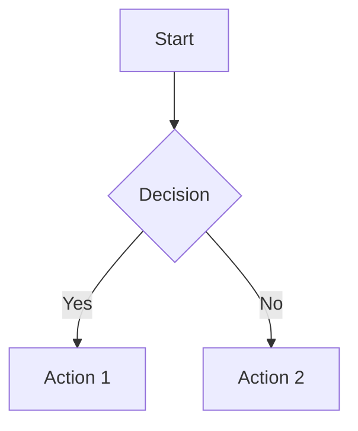

# Markdown Viewer for macOS

macOS用のシンプルで使いやすいMarkdownビューアアプリケーションです。

## 機能

- Markdownファイルの美しいレンダリング
- 複数のウィンドウで複数のファイルを同時に開ける
- ドラッグ&ドロップでファイルを開く（複数ファイル対応）
- プレビュー内容のテキスト選択とコピーが可能（Command-C、編集メニューからコピー）
- GitHub風のスタイリング
- Mermaid図表のレンダリング対応 (フローチャート、シーケンス図、ガントチャートなど)
- キーボードショートカットによるスクロール操作
- ファイルの自動監視と再読み込み
- リロード時のスクロール位置保持 (Command-Rでのリロードや、ファイル変更検知による自動リロード時に、現在のスクロール位置が保持されます)

## ビルド方法

### 必要な環境

- Xcode 16.3以降

### 初回セットアップ (swift-markdownパッケージの追加)

1. Xcodeでプロジェクトを開く:

```bash
open MarkdownViewer.xcodeproj
```

1. swift-markdownパッケージを追加:

   - Xcodeのプロジェクトナビゲータで `MarkdownViewer` プロジェクトを選択
   - `PROJECT` > `MarkdownViewer` を選択
   - `Package Dependencies` タブを選択
   - `+` ボタンをクリック
   - 検索フィールドに `https://github.com/swiftlang/swift-markdown.git` を入力
   - `Add Package` をクリック
   - `Markdown` プロダクトを選択して `Add Package` をクリック

### ビルド手順

1. Xcodeで以下の手順を実行:

   - メニューから `Product` > `Build` を選択（または `⌘B`）
   - ビルドが成功したら `Product` > `Run` を選択（または `⌘R`）

### コマンドラインからのビルド

```bash
xcodebuild -project MarkdownViewer.xcodeproj -scheme MarkdownViewer -configuration Release build
```

アプリは `build/Release/MarkdownViewer.app` としてビルドされます:

## 使い方

1. アプリケーションを起動
2. 以下のいずれかの方法でファイルを開きます:
   - メニューバーから `File > Open...` を選択 (`Command-O`)
   - Markdownファイル（`.md`または`.markdown`）をウィンドウにドラッグ&ドロップ
   - コマンドラインから: `open -a MarkdownViewer file1.md file2.md file3.md`
   - Finderからアプリにファイルをドラッグ&ドロップ

### 複数ウィンドウ機能

- **新しいウィンドウを開く**: `Command-N` で空のウィンドウを作成
- **複数ファイルを開く**: ファイル選択ダイアログで複数ファイルを選択、または複数のファイルをドラッグ&ドロップ
- **各ウィンドウは独立**: 各ウィンドウで異なるファイルを表示し、個別にファイル監視と自動再読み込みを行います

### Mermaid図表のサポート

Mermaidコードブロックを使用して、フローチャート、シーケンス図、ガントチャートなどの図表をレンダリングできます。

例：

````markdown

````

Mermaidの詳細については、[Mermaid公式ドキュメント](https://mermaid.js.org/)を参照してください。

## キーボードショートカット

ファイル操作やスクロールのためのショートカットが利用できます。

### ファイル操作

| キー          | 動作                           |
|---------------|--------------------------------|
| `Command-N`   | 新しいウィンドウを開く         |
| `Command-O`   | ファイルを開く（複数選択可能） |
| `Command-R`   | ファイルを再読み込み           |

### スクロール操作

| キー                           | 動作                   |
|--------------------------------|------------------------|
| `j`, `↓`, `Control-n`    | 1行下へスクロール      |
| `k`, `↑`, `Control-p`    | 1行上へスクロール      |
| `Space`, `PageDown`      | 1ページ下へスクロール  |
| `Shift-Space`, `PageUp`  | 1ページ上へスクロール  |
| `Home`, `Command-<`      | ドキュメントの先頭へ移動 |
| `End`, `Command->`, `G`  | ドキュメントの末尾へ移動 |

### テキスト操作

| キー          | 動作                           |
|---------------|--------------------------------|
| `Command-C`   | 選択したテキストをコピー       |
| `Command-A`   | すべてのテキストを選択         |

## 技術スタック

- **言語**: Swift 5.0
- **フレームワーク**: SwiftUI, WebKit
- **対象OS**: macOS 13.0以降

## 更新履歴

### バージョン 1.7
- リンク対応
  - 外部リンク (http/https など) は既定ブラウザで開く
  - ローカルの Markdown ファイル (`.md`/`.markdown`) への相対/絶対リンクは別ウインドウで開く (読み取れない場合や Markdown 以外は何もしない)
  - ページ内アンカー (`#section` 等) に対応。見出しには自動的に slug ID を付与
  - 別ファイル + fragment (`other.md#inner`) で開いたリンクは、開いたウインドウで該当見出しへスクロール
- YAML frontmatter 対応
  - Markdown ファイル先頭の `---` で囲まれた frontmatter を検出し、本文とは別枠 (薄紫の枠 + monospace) で表示

### バージョン 1.6
- 変更箇所の自動ハイライト機能を追加
  - ファイル再読み込み時に、前回からの差分を黄色背景で強調表示

### バージョン 1.5
- コードベースの大規模なリファクタリングを実施
  - スクロールメソッドの重複コードを共通ヘルパーに統合
  - キーイベントハンドラを宣言的なKeyBindingHandlerシステムに変換
  - HTMLレンダリングロジックを焦点を絞った複数のメソッドに分解
  - FileWatcherクラスを別ファイルに抽出し、関心の分離を改善
  - コードの保守性、テスト可能性、可読性が大幅に向上

### バージョン 1.4
- プレビュー内容のテキスト選択とコピー機能を追加
  - プレビュー内容を選択して、Command-Cや編集メニューからコピーできるようになりました
  - Command-Aで全選択が可能です

### バージョン 1.3
- Mermaid図表のレンダリングサポートを追加
  - フローチャート、シーケンス図、ガントチャートなどのMermaid図表を自動的にレンダリングします
  - ` ```mermaid ` コードブロックを使用して図表を記述できます

### バージョン 1.2
- リロード時のスクロール位置保持機能を追加
  - Command-Rでの手動リロード時にスクロール位置が保持されるようになりました
  - ファイル変更検知による自動リロード時にもスクロール位置が保持されるようになりました

### バージョン 1.1
- 複数ウィンドウ対応
- 複数ファイルの同時オープン機能
- ファイルの自動監視と再読み込み機能
- キーボードショートカットによるスクロール操作

### バージョン 1.0
- 初回リリース
- 基本的なMarkdownレンダリング機能
- ドラッグ&ドロップサポート

## ライセンス

このプロジェクトはMITライセンスで公開されています。
